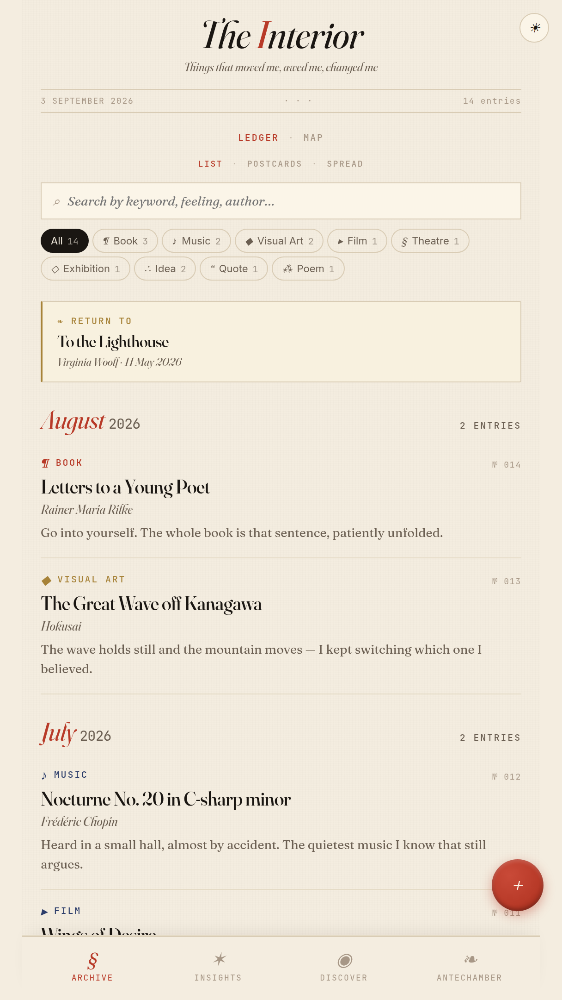
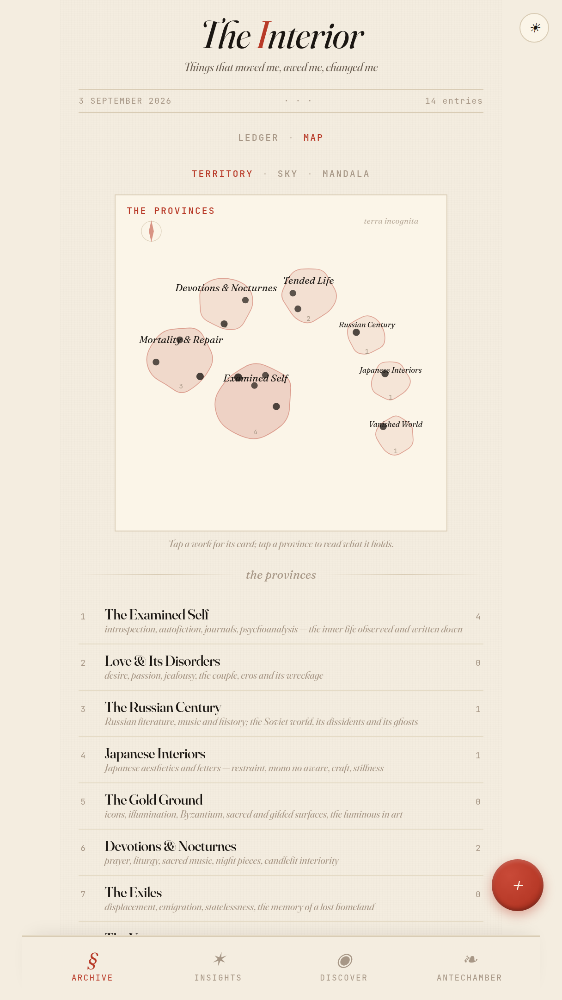
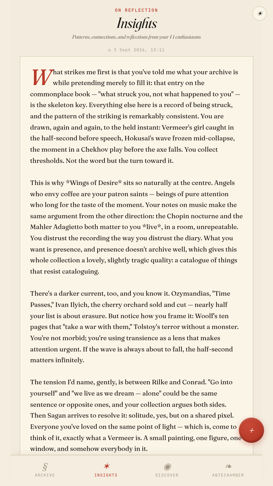
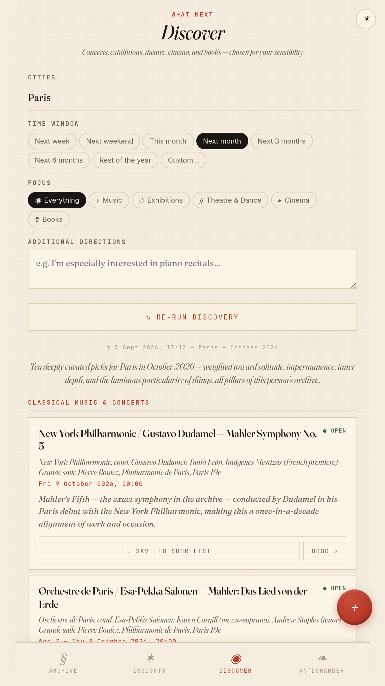
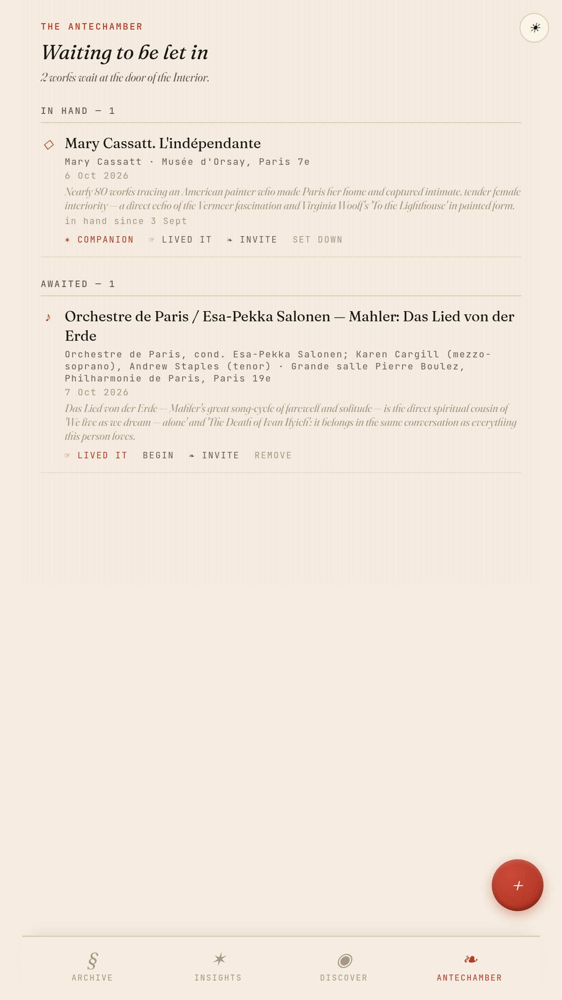
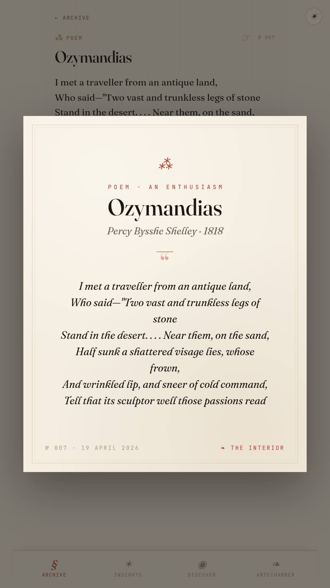

# The Interior

*A commonplace book that reads you back.*

- **What it is** — a private archive of everything that has moved you: books, concerts, paintings, plays, poems, ideas, quotes.
- **What it refuses** — no feed, no likes, no infinite scroll. The only algorithm is your own taste.
- **Who it's for** — one person at a time. Yours runs on your own database, under your own key.

## See it

<table align="center"><tr><td>
<video src="https://github.com/user-attachments/assets/295d1d85-d267-4ab9-9d0e-17ca5e493ead" controls></video>
</td></tr></table>

<i>The guided tour — 3½ minutes, narrated · <a href="https://lydieberget.github.io/the-interior/docs/demo.mp4">full quality</a></i>

<b><a href="https://lydieberget.github.io/the-interior/">Try the live demo →</a></b> A sample archive, already furnished. Nothing to install; nothing you do there is kept.

## Six rooms

<table>
<tr>
<td align="center"> <b>The Ledger</b> — every entry, newest first, folio-numbered.</td>
<td align="center"> <b>The Map</b> — your taste drawn as provinces of an interior world.</td>
<td align="center"> <b>Insights</b> — an essay about your own taste, written from the archive.</td>
</tr>
<tr>
<td align="center"> <b>Discover</b> — real events, chosen from your archive. Every pick says why.</td>
<td align="center"> <b>The Antechamber</b> — the room for things not yet lived, with a companion for each.</td>
<td align="center"> <b>Postcards</b> — send an entry, or an invitation, to a friend as a picture.</td>
</tr>
</table>

## The life of one event

<b>◉ Discovered → ❧ Saved → ✶ In hand → ☞ Lived → ¶ Inscribed</b>

<i>What the archive found for you becomes the archive.</i>

## Why it's built this way

- **No build step** — the browser is the compiler; the repo *is* the app.
- **One serverless function** — the only server code, so the API key never reaches the client.
- **Your data, your database** — a single Supabase table with row-level security for one owner.
- **Offline first** — installs as an app, opens without a network, syncs when it can.

## Run your own

1. **Supabase** (free): create a project, run `supabase/schema.sql` in the SQL editor, put your project URL and publishable key in `src/db.js`.
2. **Vercel** (free): import the repo — framework *Other*, no build command, no output directory — and add `ANTHROPIC_API_KEY`.
3. Open the app: sign in with your email (a code arrives by return), or *keep to this device*.
4. Optional: import `docs/demo-entries.json` to see it furnished, then begin your own.

AI features bill per use to your Anthropic key — an essay or a letter costs a few cents.

## Design

Warm paper, a vermilion rubric, a variable serif, hairline borders. Nothing louder than the words.

<a href="docs/PHILOSOPHY.md">Why it's built this way (the long version)</a> · <a href="docs/ARCHITECTURE.md">Architecture</a> · <a href="LICENSE">MIT</a> 
Video music: Chopin, Nocturne No. 20 — Frank Lévy for Musopen, public domain.

