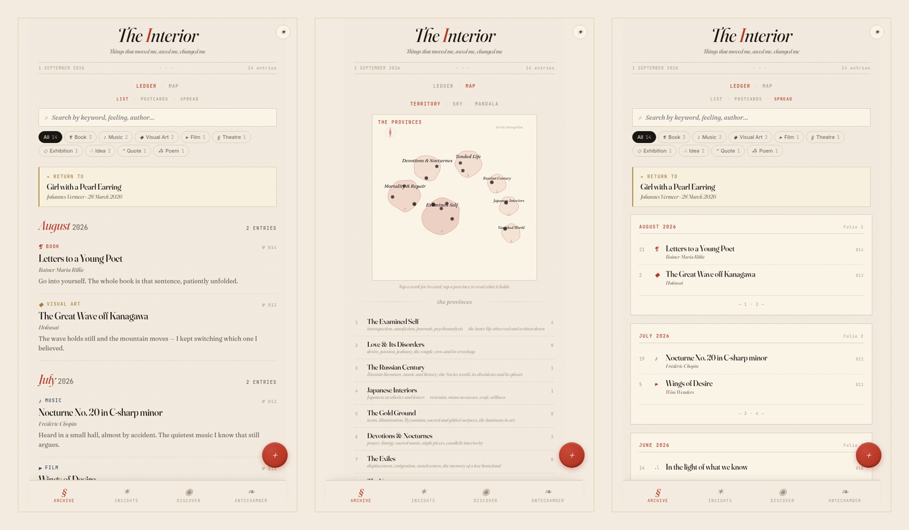
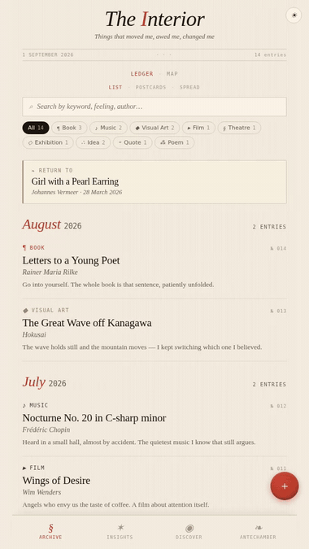

<div align="center">

# The Interior

*A private commonplace book — and a recommendation engine whose only algorithm is your own taste.*

</div>



## Why

Every feed you own studies what you love in order to sell your attention. **The Interior turns that around.** You keep a quiet archive of everything that has moved you — books, concerts, paintings, plays, poems, ideas, quotes — and when you want something new, *that archive* goes looking: real exhibitions near you, concerts this season, books chosen because of what you've loved, with every recommendation naming the entry it grew from.

There is no feed. No likes, no metrics, no infinite scroll. Recommendations arrive as a short letter, and the letter ends. It is personal software in the old sense: built for one reader at a time, tuned for interior life and calm.

## See it

<div align="center">

</div>

**[▶ Watch the full guided tour](docs/demo.mp4)** — 3½ minutes, narrated: the archive, the taste-map, the AI essay on your taste, and the full life of one real event — discovered, saved, lived, inscribed.

## What it does

- **Archive** — your entries in four readings: a bookkeeper's **Ledger**, picture **Postcards**, a slow **Spread**, and a **Map** that scores every entry against thirteen "provinces" of an interior world and draws your taste as a territory, a sky of constellations, or a rose.
- **Insights** — the model reads the whole archive and writes you an essay about your own taste; you can question it afterwards.
- **Discover** — tell it where you are and when you're free. It web-searches real programmes and dates, then chooses *from your archive, not from what's trending*. Focus it on everything, or just concerts, exhibitions, theatre, cinema, books.
- **The Antechamber** — the room for things not yet lived. Save a recommendation; press **Begin** when you book; a spoiler-free **companion sheet** appears, grounded in what you already love; after the evening, **Lived it** turns the event into an archive entry, already filled in. What the archive found for you becomes the archive.
- Cloud sync (Supabase, single-owner), offline-first PWA, light and dark, covers from Open Library, photographs in private storage.

## How it's built (deliberately unusual)

**There is no build step.** React and Babel load from `vendor/`, and the `.jsx` transpiles in the browser at load time. No bundler, no `node_modules`, no framework churn — the repo *is* the app. One serverless function (`api/claude.js`) proxies the Anthropic API so the key never reaches the client. Postgres + row-level security (Supabase) keep the archive private to its one owner; localStorage keeps it instant and offline.

```
index.html          the shell, top-level state, the API gateway
src/*.jsx, *.js     views, components, data model — transpiled in the browser
api/claude.js       the only server code: an Anthropic API proxy
supabase/schema.sql the whole backend, one file
vendor/             React, Babel, supabase-js — pinned, self-hosted
```

## Run your own

1. **Supabase** (free tier): create a project, paste `supabase/schema.sql` into the SQL editor, run it. In `src/db.js`, fill in your project URL and publishable key.
2. **Vercel** (free tier): import the repo — framework *Other*, no build command, no output directory. Add the environment variable `ANTHROPIC_API_KEY` ([console.anthropic.com](https://console.anthropic.com)).
3. Open the app, sign in with your email (a code arrives by return), or choose *keep to this device*.
4. Optional: import `docs/demo-entries.json` (Archive → bottom → Import) to see it furnished, then delete and begin your own.

Costs: hosting is free-tier on both services; the AI features bill per use to your Anthropic key — an Insights essay or Discover letter is a few cents each.

## Design

Warm paper, a vermilion rubric, hairline borders, a variable serif. The aesthetic is an editorial commonplace book, and restraint is a feature: no emoji, no cards with big shadows, nothing louder than the words. All colour and type live as tokens in `src/styles.css`.

## License

[MIT](LICENSE). The demo video's music is Chopin's Nocturne No. 20 in C♯ minor, performed by Frank Lévy for [Musopen](https://musopen.org)'s *Set Chopin Free* project — public domain.
